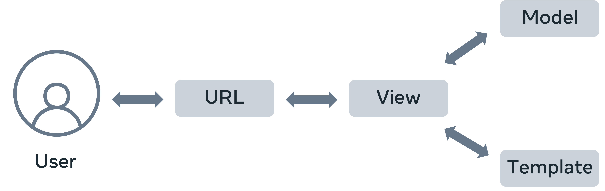
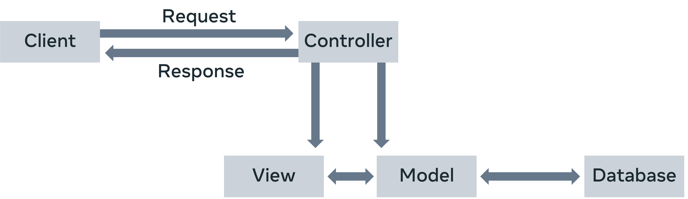

# Django Web Framework Course Summary

## Table of Contents

1. [Introduction](#introduction)
2. [Course Structure](#course-structure)
3. [Overview of Django Framework](#overview-of-django-framework)
   - [What is Django?](#what-is-django)
   - [Benefits of Using Django](#benefits-of-using-django)
   - [Real-World Applications](#real-world-applications)
   - [Key Features](#key-features)
   - [Overall Advantages](#overall-advantages)
4. [Projects & Apps Overview](#projects--apps-overview)
   - [Django Project and App Structure Overview](#django-project-and-app-structure-overview)
   - [Core Concepts](#core-concepts)
   - [App Design](#app-design)
5. [Project Structure](#project-structure)
6. [Creating a Django App](#creating-a-django-app)
7. [Django Management Commands](#django-management-commands)
8. [Understanding Web Frameworks and Django](#understanding-web-frameworks-and-django)
9. [MVT Overview in Django](#mvt-overview-in-django)
10. [MVC Architecture](#mvc-architecture)
11. [Django Application Components](#django-application-components)
12. [Additional Resources](#additional-resources)

---

## Introduction

- Django is an open-source Python framework for building large-scale web applications.
- Requires knowledge of databases, Python, HTML, and CSS.

## Course Structure

- **Module 1:** Introduction to Django, including projects and apps, and the MVT pattern.
- **Module 2:** Exploring views, handling HTTP requests/responses, URL patterns, and class-based views.
- **Module 3:** Working with models, using Django admin, QuerySet API, forms, and MySQL database.
- **Module 4:** Templates, template language, third-party libraries, debugging, and testing.
- **Module 5:** Course recap and final project to create a data-driven web application for Little Lemon Restaurant.

### Learning Approach

- Watch and re-watch videos, engage with course readings, and complete exercises.
- Participate in quizzes and discussions to reinforce learning.
- Regular study schedule recommended for best results.

## Overview of Django Framework

### What is Django?

- Open-source web development framework written in Python.
- Initially created for a newspaper publisher's web application.
- Ideal for high-text-content, media-rich, and high-traffic projects.

### Benefits of Using Django

- Provides essential components (templates, libraries, APIs) to avoid reinventing common features.
- Ensures robust, secure, adaptable, and scalable functionalities.
- Supports integration with various tools and other Python libraries.

### Real-World Applications

- **Publishing:** Handles large volumes of text and media.
- **eCommerce, Healthcare, Finance:** Reliable for handling complex and secure transactions.
- **Social Media & Networking:** Used by major platforms like Instagram for scalability.
- **Machine Learning & AI:** Facilitates deployment of ML models via APIs, RPCs, and WebSockets.
- **SaaS Applications:** Enhances performance with asynchronous views for concurrent processing.
- **OTT Media Platforms:** Powers streaming services with high demand for scalability.

### Key Features

- **Scalability:** Easily adapts to growing user bases and resource demands.
- **Fault Tolerance:** Reliable for large projects with high traffic.
- **Cost-Effective:** Open-source nature reduces costs.
- **Community & Documentation:** Strong support and comprehensive resources available.

### Overall Advantages

- Avoids redundant development.
- Facilitates integration with various front-end frameworks.
- Ideal for organizations needing a robust back-end framework.

## Projects & Apps Overview

### Django Project and App Structure Overview

- **Website Basics:** Static websites use HTML, CSS, and JavaScript with simple folder structures.
- **Dynamic Web Applications:** Require complex functionality (state management, data storage) and streamline development with Django.

### Core Concepts

- **HTTP:** Essential for web communication; every action is tied to HTTP requests and URLs.
- **Web Server:** Handles requests and responses; Django includes a development server.
- **Database:** Stores and retrieves data; necessary for dynamic websites.
- **Apps in Django:** Include models, views, templates, URLs, and more.

### App Design

- Apps should be feature-targeted and focused on a single purpose.
- A Django project can contain multiple apps, each responsible for a specific feature.

## Project Structure

To create a new project, use the `startproject` command:

```bash
django-admin startproject demoproject 
```

Example structure:

```arduino
myproject/
    manage.py
    myproject/
        __init__.py
        settings.py
        urls.py
        wsgi.py
        asgi.py
    app1/
        ...
    app2/
        ...
```

## Creating a Django App

To create a new app in a Django project, use:

```bash
python manage.py startapp <name_of_app>
```

### App Structure

```python
<name_of_app>/
    __init__.py
    admin.py
    apps.py
    models.py
    views.py
    migrations/
        __init__.py
    templates/  # Optional
    static/     # Optional
```

### Next Steps

1. Add the app to `INSTALLED_APPS` in `settings.py`:

   ```python
   INSTALLED_APPS = [
       '<name_of_app>',
   ]
   ```

## Django Management Commands

### `makemigrations`

Generates migration files for changes made to your models:

```bash
python manage.py makemigrations
```

### `migrate`

Applies migrations to synchronize the database with the current state of models and migrations:

```bash
python manage.py migrate
```

### `runserver`

Starts Django’s built-in development server:

```bash
python manage.py runserver
```

## Understanding Web Frameworks and Django

### Overview

- Frameworks provide a structured foundation to build web applications efficiently.
- Django is a high-level Python framework designed for rapid development and clean design.

### Key Takeaways

- **Frameworks**: Offer a solid foundation for building applications.
- **Django**: Popular for its speed, feature set, security, and scalability.
- **Three-Tier Architecture**: Splits applications into presentation, application, and data tiers for better organization.

## MVT Overview in Django

### Django’s MVT Pattern



- **Model**: Manages data and interacts with the database.
- **View**: Handles processing logic and user requests.
- **Template**: Renders the presentation layer.

### Workflow

1. View processes requests and interacts with the Model.
2. Model manages data.
3. Template formats and renders data into HTML for the client.

## MVC Architecture



### Components of MVC

1. **Model**: Manages data and interacts with the backend database.
2. **View**: Handles the presentation layer of the application.
3. **Controller**: Intercepts user requests and coordinates between the View and Model.

### Key Benefits

- **Separation of Concerns**: Divides the application into distinct responsibilities.
- **Modularity**: Allows independent development and testing of each component.

## Django Application Components

1. **URL Dispatcher**: Maps URL patterns to view functions (defined in `urls.py`).
2. **View**: Handles the logic and processes requests (defined in `views.py`).
3. **Model**: Defines data structure and manages database interactions (defined in `models.py`).
4. **Template**: Manages the presentation layer (located in the `templates` folder).

### Workflow_overall

1. URL Dispatcher matches URL patterns to view functions.
2. View processes requests, interacts with models, and prepares the response.
3. Model manages data and database operations.
4. Template renders dynamic HTML based on the context provided by the view.

## Additional Resources

- [Django Official Website](https://www.djangoproject.com/start/overview/)
- [Django Documentation](https://docs.djangoproject.com/en/4.1/)
- [Writing Your First Django App – Official Documentation](https://docs.djangoproject.com/en/4.1/)
- [MVT Framework - Django](https://docs.djangoproject.com/en/4.1/faq/general/#django-appears-to-be-a-mvc-framework-but-you-call-the-controller-the-view-and-the-view-the-template-how-come-you-don-t-use-the-standard-names)
- [How to Structure Your Django Project](https://docs.djangoproject.com/en/4.1/intro/tutorial01/)
