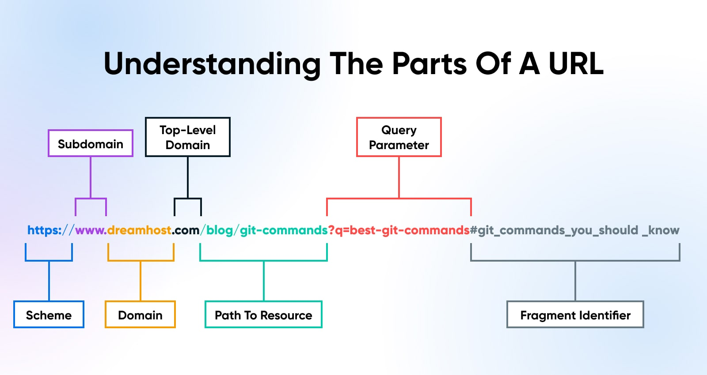

# Learning Objectives

1. **Create Views and View Logic**
   - Understand how to process basic HTTP requests in Django.

2. **Class-Based Views**
   - Utilize class-based views for reusable components across a project.

3. **Map URLs to Views**
   - Implement URL mapping to connect specific URLs to corresponding views.

4. **Request and Response Objects**
   - Use request and response objects for common operations like handling data and sending responses.

5. **Regular Expressions for URL Patterns**
   - Employ regular expressions to define various URL patterns in Django.

6. **HTTP Methods and Parameters**
   - Differentiate between parameters and their association with HTTP methods: GET, PUT, POST, and DELETE.

7. **Error Handling**
   - Implement error handling at the HTTP, view logic, and view levels to manage exceptions and provide user feedback.

---

This Module will help you cover all essential aspects of working with views and URLs in Django!

## Django Views and URL Configuration

**Overview:**

- Static websites serve fixed content, but dynamic websites use frameworks like Django to handle requests and render dynamic data.
- In Django, views and URL configuration are crucial for processing HTTP requests and delivering responses.

**Django Views:**

- **What is a View?**
  - A view is a Python function in `views.py` that takes an HTTP request and returns an HTTP response (e.g., HTML document).
  
- **Creating a View:**
  1. **Import HTTP Response Class:**

     ```python
     from django.http import HttpResponse
     ```

  2. **Define a View Function:**

     ```python
     def home(request):
         content = "<html><body><h1>Welcome</h1></body></html>"
         return HttpResponse(content)
     ```

     - The function name is flexible but should be descriptive.
  
**URL Configuration:**

- **Project-Level `urls.py`:**
  - Manages overall URL routing and incorporates app-level URLs.
  - Uses the `include` function to reference app-specific `urls.py`.

- **App-Level `urls.py`:**
  - Contains URL patterns specific to the app.
  - Each URL pattern maps to a view function.

- **Setting Up URL Configuration:**
  1. **Create the Project and App:**
     - Initialize a Django project.
     - Create an app within the project (e.g., `myapp`).

  2. **Define a View Function:**
     - In `views.py`:

       ```python
       from django.http import HttpResponse
       
       def home(request):
           return HttpResponse("Welcome to the Little Lemon restaurant")
       ```
  
  3. **Create App-Level `urls.py`:**
     - Import necessary functions:

       ```python
       from django.urls import path
       from . import views
       ```

     - Define URL patterns:

       ```python
       urlpatterns = [
           path('', views.home, name='home'),
       ]
       ```

  4. **Configure Project-Level `urls.py`:**
     - Import the `include` function:

       ```python
       from django.urls import path, include
       ```

     - Reference the app’s `urls.py`:

       ```python
       urlpatterns = [
           path('', include('myapp.urls')),
       ]
       ```

  5. **Run the Development Server:**
     - Start the server with `python3 manage.py runserver`.
     - Verify the setup by navigating to the local host URL.

**Summary:**

- **Views** handle HTTP requests and responses, with logic defined in `views.py`.
- **URL Configuration** involves setting up `urls.py` files at both the project and app levels:
  - Project-level `urls.py` includes app-level URLs using `include`.
  - App-level `urls.py` maps URL patterns to view functions.
- Proper URL configuration ensures requests are correctly routed and handled.

---

## Django View Logic

**Role of the View:**

- In Django's MVT (Model-View-Template) architecture, the view is essential for handling client requests and interacting with both the model and template layers.
- The view function processes HTTP requests and sends appropriate responses, typically involving data retrieval or manipulation.

**Functionality of Views:**

1. **Handling Requests:**
   - **GET Method:** Used for reading or deleting data. Example:

     ```python
     from django.shortcuts import render
     
     def myview(request):
         if request.method == 'GET':
             val = request.GET['key']  # Read or delete operation
     ```

   - **POST Method:** Used for creating or updating data. Example:

     ```python
     from django.shortcuts import render
     
     def myview(request):
         if request.method == 'POST':
             val = request.POST['key']  # Insert or update operation
     ```

2. **Generating Responses:**
   - The view returns an `HttpResponse` object containing HTML content and status code. Example:

     ```python
     from django.http import HttpResponse
     
     def myview(request):
         return HttpResponse("Response content", content_type="text/html")
     ```

3. **Rendering Templates:**
   - Views can use the `render` function to load a template, insert context data, and return an HTML response. Example:

     ```python
     from django.shortcuts import render
     
     def myview(request):
         context = {'key': 'value'}
         return render(request, 'template.html', context)
     ```

**Class-Based Views (CBVs):**

- **Function-Based Views (FBVs):** Traditional views defined as Python functions, handling logic in an imperative style.
- **Class-Based Views:** Offer a more organized approach by subclassing `View` and overriding methods for GET and POST requests.

  ```python
  from django.views import View
  from django.http import HttpResponse
  
  class MyView(View):
      def get(self, request):
          return HttpResponse('Response to GET request')
      
      def post(self, request):
          return HttpResponse('Response to POST request')
  ```

**Generic Class-Based Views:**

- Simplify common view patterns (e.g., rendering templates, CRUD operations) using pre-defined generic views.
- Examples include `TemplateView`, `CreateView`, `ListView`, `DetailView`, `UpdateView`.
- You subclass these views and set properties like `model` and `template_name`, letting Django handle most of the heavy lifting.

**Key Points:**

- **Function-Based Views** offer straightforward, imperative logic.
- **Class-Based Views** provide a more structured approach with reusable components.
- **Generic Views** further streamline common tasks, reducing boilerplate code.

Understanding these concepts is crucial as you progress in Django development, with class-based and generic views being widely used in practice.

---

### Creating and Mapping Django View Functions

**Objective:**

- Learn how to create Django view functions that return text and HTML, and map these functions to URLs for display in a web browser.

**Steps and Examples:**

1. **Create a View Function:**
   - Open `views.py` and define a function to return text or HTML.
   - Example:

     ```python
     from django.http import HttpResponse
     
     def hello(request):
         return HttpResponse("Hello World")
     
     def homepage(request):
         return HttpResponse("Welcome to Little Lemon")
     
     def display_date(request):
         from datetime import datetime
         year = datetime.now().year
         return HttpResponse(f"This year is {year}")
     
     def menu(request):
         html = "<html><body><h1 style='color:blue;'>Menu</h1></body></html>"
         return HttpResponse(html)
     ```

2. **Map View Function to URL:**
   - Open `urls.py` in your project directory.
   - Import the view functions from `views.py`.
   - Define URL patterns to map URLs to view functions.
   - Example:

     ```python
     from django.urls import path
     from myapp import views
     
     urlpatterns = [
         path('hello/', views.hello),
         path('homepage/', views.homepage),
         path('display-date/', views.display_date),
         path('menu/', views.menu),
     ]
     ```

3. **Run the Development Server:**
   - Start the server using:

     ```bash
     python manage.py runserver
     ```

   - Access the URLs in your browser:
     - `http://localhost:8000/hello/` displays "Hello World".
     - `http://localhost:8000/homepage/` displays "Welcome to Little Lemon".
     - `http://localhost:8000/display-date/` shows the current year.
     - `http://localhost:8000/menu/` renders HTML with CSS styling.

**Key Points:**

- **View Functions**: Handle HTTP requests and return responses (text or HTML).
- **URL Mapping**: Connect view functions to specific URLs via `urls.py`.
- **Testing**: Always save files and test URLs to ensure correct output.

# Requests and URL

## Overview of HTTP and HTTPS

### What is HTTP?

- **HTTP** (Hypertext Transfer Protocol) is the foundational protocol for communication on the web.
- It facilitates the transfer of web resources like HTML documents, images, and files through a request-response model.

## HTTP Requests

- **Structure**: Consists of a method, path, version, and headers.
- **Methods**:
  - **GET**: Retrieve information from the server.
  - **POST**: Send data to the server.
  - **PUT**: Update existing resources on the server.
  - **DELETE**: Remove resources from the server.
- **Path**: Indicates the location of the resource on the server.
- **Headers**: Provide additional information about the request (e.g., content type, server name).

## HTTP Responses

- **Structure**: Similar to requests, typically includes headers and an optional message body.
- **Status Codes**: Indicate the outcome of the request, grouped as follows:
  - **Informational (100-199)**: Provisional responses (e.g., 100 CONTINUE).
  - **Successful (200-299)**: Request successfully processed (e.g., 200 OK).
  - **Redirection (300-399)**: Resource has moved (e.g., 301 Moved Permanently).
  - **Client Errors (400-499)**: Bad syntax or unauthorized access (e.g., 404 Not Found).
  - **Server Errors (500-599)**: Server issues processing the request (e.g., 500 Internal Server Error).

## What is HTTPS?

- **HTTPS** (HTTP Secure) is the secure version of HTTP, using encryption to protect data during transmission.
- Identified by a lock icon in the web browser, HTTPS ensures that sensitive information (like credit card details) remains private.

## Summary

- HTTP is crucial for data exchange on the web, while HTTPS enhances security through encryption.
- Understanding the structure of requests and responses, along with status codes, is essential for web development.

---

# Request and Response Objects in Django

## Overview

In Django, the request-response cycle operates based on the HTTP protocol, where a web application processes client requests and generates suitable responses. This functionality is managed through the `HttpRequest` and `HttpResponse` classes in the `django.http` module.

## HttpRequest Object

- **Purpose**: Contains metadata about the client's request.
- **Attributes**:
  - `request.method`: Indicates the HTTP method used (GET, POST, PUT, DELETE).

    ```python
    if request.method == 'GET':
        # Handle GET request
    elif request.method == 'POST':
        # Handle POST request
    ```

  - `request.GET` and `request.POST`: Return a dictionary-like object of GET and POST parameters, respectively.
  - `request.COOKIES`: Dictionary of cookies sent by the client.
  - `request.FILES`: Contains uploaded files as `UploadedFile` objects.
  - `request.user`: Provides information about the current user, returning an `AnonymousUser` if unauthenticated.
  - `request.has_key()`: Checks if a specific key exists in GET or POST parameters.

## HttpResponse Object

- **Purpose**: Constructed within the view function to return a response to the client.
- **Attributes and Methods**:
  - `status_code`: Returns the HTTP status code.
  - `content`: Returns the response content as a byte string.
  - `__getitem__()`: Retrieves a header value.
  - `__setitem__()`: Adds a header to the response.
  - `write()`: Allows writing content to the response.

## Example View Function

```python
from django.http import HttpResponse 

def index(request):
    path = request.path 
    method = request.method 
    content = ''' 
    <center><h2>Testing Django Request Response Objects</h2> 
    <p>Request path: "{}"</p> 
    <p>Request Method: "{}</p></center> 
    '''.format(path, method) 
    return HttpResponse(content)
```

This view demonstrates how to access request attributes and generate a simple HTML response.

---

# Using Request and Response Objects in Django

## Overview of the Request-Response Cycle

1. **Client Request**: The cycle begins when a user enters a URL in a web browser.
2. **Server Processing**: Django searches for a matching URL in the `urls.py` file and maps it to the associated view.
3. **View Function**: The view function receives the HTTP request as a request object, processes it, and generates an appropriate `HttpResponse`.
4. **Client Response**: The response is sent back to the client and displayed in the browser.

## Steps to Implement Request and Response Objects

1. **Set Up the View**:
   - Open `views.py` and import necessary modules.
   - Create a view function (e.g., `home`) that accepts the request object.
   - Access the request path using `request.path`.

2. **Create and Return HttpResponse**:
   - Construct the `HttpResponse` using the path variable, specifying content type and character set.
   - Example:

     ```python
     return HttpResponse(path, content_type="text/html; charset=utf-8")
     ```

3. **Test in Browser**:
   - Enter the URL `/main/home/` in the browser.
   - Observe that the path displayed matches the request.

4. **Dynamic URL Updates**:
   - Modify `urls.py` by changing or removing paths to see how Django handles the updates dynamically.

5. **Exploring HttpResponse**:
   - Create another `HttpResponse` object, assign it to a variable (e.g., `response`), and return it.
   - Example:

     ```python
     response = HttpResponse("Your message here")
     return response
     ```

6. **Display HttpRequest Attributes**:
   - Create variables for request attributes (scheme, method, user agent, etc.).
   - Use formatted string literals to display these attributes in the response:

     ```python
     message = f"<p>Method: {request.method}</p>"
     return HttpResponse(message)
     ```

7. **Update Response Headers**:
   - You can modify response headers by accessing `response.headers` and adding new entries.
   - Example:

     ```python
     response.headers['Age'] = 20
     ```

8. **Working with Forms**:
   - Utilize request and response objects to handle GET and POST methods, which is essential for forms and database interactions in Django.

# Understanding URLs



## What is a URL?

A **Uniform Resource Locator (URL)** is the address used to access resources on the web. Every time you click a link or enter an address in your browser, you are interacting with a URL.

## Components of a URL

A URL consists of several parts:

1. **Scheme (Protocol)**:
   - Indicates the method used to access the resource (e.g., HTTP or HTTPS).
   - **HTTP**: Hypertext Transfer Protocol; data is sent as plain text.
   - **HTTPS**: Secure version of HTTP; data is encrypted for security.

2. **Subdomain**:
   - Precedes the domain name, often indicating specific sections of a website (e.g., `www`).
   - Some browsers may replace the scheme and subdomain with a symbol (like a lock for HTTPS).

3. **Domain Name**:
   - Composed of two parts:
     - **Second Level Domain (SLD)**: Represents the organization or entity (e.g., `littlelemon`).
     - **Top Level Domain (TLD)**: Indicates the type or location of the entity (e.g., `.com` for commercial, `.org` for organizations, `.ie` for Ireland).

4. **File Path**:
   - Directs to the specific location of a resource on the server (e.g., `/about/contact/`).
   - Indicates where files like documents or images are stored, either locally or on a web server.

5. **URL Parameters (Query Strings)**:
   - Provide additional information for processing.
   - Begin with a `?` and consist of key-value pairs, separated by `&`.
   - Example: `?search=django&page=2`.

## URL Design

Effective URL design is crucial for web development, particularly in Django. Well-structured URLs enhance usability and SEO, ensuring they are easy to read and understand.

## Types of Parameters in Web Applications

1. **Path Parameters**:
   - These are part of the URL itself.
   - **Example**: In `http://localhost:8000/getuser/John/1`, `John` is the name, and `1` is the user ID.
   - **Usage in Django**: Defined in `urls.py` as:

     ```python
     path('getuser/<name>/<id>/', views.pathview)
     ```

   - **View Function**:

     ```python
     def pathview(request, name, id):
         return HttpResponse(f"Name: {name}, UserID: {id}")
     ```

2. **Query Parameters**:
   - Added after a `?` in the URL.
   - **Example**: In `http://localhost:8000/getuser/?name=John&id=1`, `name` and `id` are query parameters.
   - **Access in Django**: Use `request.GET` to fetch them:

     ```python
     def qryview(request):
         name = request.GET['name']
         id = request.GET['id']
         return HttpResponse(f"Name: {name}, UserID: {id}")
     ```

3. **Body Parameters**:
   - Sent via an HTML form using the POST method.
   - **Example Form**:

     ```html
     <form action="/getform/" method="POST">
         
         <p>Name: <input type="text" name="name"></p>
         <p>UserID: <input type="text" name="id"></p>
         <input type="submit">
     </form>
     ```

   - **View Function**:

     ```python
     def getform(request):
         if request.method == "POST":
             name = request.POST['name']
             id = request.POST['id']
             return HttpResponse(f"Name: {name}, UserID: {id}")
     ```

### Summary

- **Path Parameters**: Part of the URL (e.g., `/getuser/John/1`).
- **Query Parameters**: Key-value pairs in the URL (e.g., `?name=John&id=1`).
- **Body Parameters**: Data sent via forms (e.g., from a POST request).

Understanding these helps in effectively handling user input in Django applications!

### Using URL Parameters in Django

1. **Defining URL Parameters**:
   - You can capture values from the URL using angle brackets in the `path()` function.
   - **Example**: To capture a drink name:

     ```python
     path('dishes/<str:dish>/', views.menu_items, name='menu_items')
     ```

2. **Creating a View Function**:
   - The view function must accept the parameter along with the `request` object.
   - **Example**:

     ```python
     from django.http import HttpResponse

     def menu_items(request, dish):
         items = {
             'pasta': 'Delicious pasta with marinara sauce.',
             'falafel': 'Crispy falafel served with tahini.',
             'cheesecake': 'Rich cheesecake with berry topping.'
         }
         description = items.get(dish, 'Dish not found.')
         return HttpResponse(f"<h1>{dish}</h1><p>{description}</p>")
     ```

3. **Testing the URL**:
   - After setting up, run the server and navigate to `http://localhost:8000/dishes/pasta`.
   - This displays a heading with "pasta" and its description.

4. **Dynamic Content**:
   - Changing the URL to `http://localhost:8000/dishes/cheesecake` will update the content dynamically based on the dictionary in the view function.

### Applications of URL Parameters

- **Retrieving Data**: URL parameters can be used to fetch data, such as details from a database using a primary key.
- **Search and Filtering**: They can also serve for search and sorting criteria, enhancing the interactivity of your application.
- **Content Organization**: Using parameters helps create meaningful and organized content on the website.

By mastering URL parameters, you can effectively route and process information in your Django applications!

## Additional resources

Click the links below to learn more about developing in Django.

- [Creating views– official documentation](https://docs.djangoproject.com/en/4.1/topics/http/views/)
- [Class-based views – Official](https://docs.djangoproject.com/en/4.1/topics/class-based-views/)
- [The render() function in Django](https://docs.djangoproject.com/en/4.1/topics/http/shortcuts/#render)
- [Getting query parameters from a request in Django](https://docs.djangoproject.com/en/4.1/topics/http/urls/#path-converters)
- [The HTTP server responses](https://developer.mozilla.org/en-US/docs/Web/HTTP/Status)

## Creating URLs and Views

### Using Regular Expressions in Django URLs

1. **Purpose of Regular Expressions**:
   - Regex is a powerful tool for defining patterns in strings, useful for validating and extracting data.
   - In Django, regex helps ensure that URL values match specific formats before reaching the view function.

2. **Defining URL Patterns**:
   - You can use `path()` for static URLs and `re_path()` for regex-based URLs.
   - **Example of a Static URL**:

     ```python
     path('menu_item/10/', views.menu_item_view, name='menu_item_view')
     ```

     - This URL only matches `menu_item/10/`, leading to a 404 error for other values like `menu_item/1/`.

   - **Example of a Regex URL**:

     ```python
     from django.urls import re_path

     re_path(r'^menu_item/([0-9]{1,2})/$', views.menu_item_view, name='menu_item_view')
     ```

     - This matches URLs like `menu_item/1/` to `menu_item/99/`, making it dynamic.

3. **Common Regex Symbols**:
   - **^**: Start of the string.
   - **$**: End of the string.
   - **[ ]**: Character set (matches any character inside).
   - **{ }**: Specifies the exact number of preceding characters.
   - **( )**: Groups parts of the regex.

4. **Example Explanation**:
   - The regex pattern `^menu_item/([0-9]{1,2})/$` matches:
     - `menu_item/1/` to `menu_item/99/`
   - This structure allows for a single view function to handle multiple menu items dynamically based on the item ID provided in the URL.

5. **Learning Regex**:
   - Regex can be complex, so it's essential to practice and familiarize yourself with common patterns.
   - Resources are available for further reading to deepen your understanding.

### Key Takeaway

Using regular expressions in Django allows developers to create flexible and dynamic URL structures, significantly reducing the need for separate static pages for each resource. This can enhance the maintainability and scalability of your web applications.

### Summary: URL Namespacing and Views in Django

In Django, managing URLs across multiple applications can lead to naming conflicts, especially when different apps define views with the same name. To resolve this issue, Django provides a mechanism for namespacing URLs, allowing for clearer organization and easier maintenance of your project.

#### Key Concepts

1. **Defining URL Patterns**:
   Each Django app has its own `urls.py` file where you define URL patterns using the `path()` function.

   **Example**:

   ```python
   # demoapp/urls.py
   from django.urls import path
   from . import views

   urlpatterns = [
       path('', views.index, name='index'),
       path('login/', views.login, name='login'),
   ]
   ```

2. **Using the `reverse()` Function**:
   Instead of hardcoding URLs, you can use the `reverse()` function to dynamically retrieve URLs based on their names.

   **Example**:

   ```python
   from django.urls import reverse

   url = reverse('index')  # returns '/demo/'
   ```

3. **Application Namespace**:
   To avoid naming conflicts, define an `app_name` variable in the app’s `urls.py`. This groups URLs under a specific namespace.

   **Example**:

   ```python
   # demoapp/urls.py
   app_name = 'demoapp'

   urlpatterns = [
       path('', views.index, name='index'),
   ]
   ```

   You can then retrieve the URL with the namespace:

   ```python
   url = reverse('demoapp:index')  # returns '/demo/'
   ```

4. **Adding Multiple Apps**:
   If you add another app (e.g., `newapp`) with its own `index` view, define its `app_name` similarly.

   **Example**:

   ```python
   # newapp/urls.py
   app_name = 'newapp'

   urlpatterns = [
       path('', views.index, name='index'),
   ]
   ```

   Use the `reverse()` function to differentiate:

   ```python
   url = reverse('newapp:index')  # returns '/newdemo/'
   ```

5. **Instance Namespace**:
   You can also use the namespace parameter when including an app’s URLs in the project’s main `urls.py`.

   **Example**:

   ```python
   urlpatterns = [
       path('demo/', include('demoapp.urls', namespace='demoapp')),
   ]
   ```

6. **Using Namespaced URLs in Views**:
   You can redirect to a namespaced URL from within a view:

   **Example**:

   ```python
   from django.http import HttpResponsePermanentRedirect
   from django.urls import reverse

   def myview(request):
       return HttpResponsePermanentRedirect(reverse('demoapp:login'))
   ```

7. **Using Namespaced URLs in Templates**:
   When defining forms, avoid hardcoding URLs by using the `` template tag with the namespace:

   **Example**:

   ```html
   <form action="" method="post">
       <input type='submit'>
   </form>
   ```

### Conclusion

Using URL namespacing in Django helps manage views from multiple apps efficiently and prevents conflicts from similarly named views. This makes your application easier to maintain and scale as it grows. By mastering these concepts, you enhance your ability to build robust Django applications.

## Error Handling in Django

In web applications, errors are inevitable due to various factors like network issues or unexpected user inputs. Understanding how to handle these errors effectively is crucial for developers. This guide outlines how to manage client and server errors in Django, along with implementing custom error handling views.

### Common HTTP Status Codes

**Client Error Responses (4xx):**

1. **400 Bad Request**: The server could not understand the request due to invalid parameters.
2. **401 Unauthorized**: User authentication is required to access the resource.
3. **403 Forbidden**: The server understood the request but refuses to authorize it, usually due to insufficient permissions.
4. **404 Not Found**: The requested resource could not be found on the server.

**Server Error Responses (5xx):**

1. **500 Internal Server Error**: A generic error indicating that the server failed to process the request. This often means there's an issue with the application.

#### Handling Errors in Django

Django manages errors by raising exceptions, which can be customized through specific error handling views. You can set these up in the main URL configuration file of your project.

**Custom Error Handlers:**
Django allows you to define custom views for handling errors using the following handler variables:

- `handler400`: Custom view for 400 Bad Request errors.
- `handler403`: Custom view for 403 Forbidden errors.
- `handler404`: Custom view for 404 Not Found errors.
- `handler500`: Custom view for 500 Internal Server errors.

#### Implementing Custom Views

To customize error responses, create a new `views.py` file in your project and define functions that return appropriate HTTP response classes.

**Example of Custom Views**:

```python
from django.http import HttpResponseBadRequest, HttpResponseForbidden, HttpResponseNotFound, HttpResponseServerError

def custom_bad_request(request, exception):
    return HttpResponseBadRequest("Your custom message for bad request.")

def custom_forbidden(request, exception):
    return HttpResponseForbidden("Your custom message for forbidden access.")

def custom_not_found(request, exception):
    return HttpResponseNotFound("Your custom message for not found.")

def custom_server_error(request):
    return HttpResponseServerError("Your custom message for server error.")
```

#### Setting Up Custom Handlers

In your main `urls.py`, assign the custom views to the handler variables:

```python
from django.urls import path
from . import views

handler400 = views.custom_bad_request
handler403 = views.custom_forbidden
handler404 = views.custom_not_found
handler500 = views.custom_server_error
```

### Conclusion

Error handling in Django is essential for creating robust applications. By implementing custom error views, you can provide users with clear, helpful messages instead of generic error pages, enhancing the user experience. Understanding and applying these concepts will improve your skills as a developer.

## Handling Errors in Django Views

In a Django application, view functions are crucial as they process requests and formulate responses. This guide outlines how to handle runtime errors or exceptions within these views.

#### HTTP Responses and Status Codes

Every response from a view is an `HttpResponse` object, associated with a specific status code. For example:

- **404 Not Found**: Indicates that the requested resource could not be found.

Django provides a convenient class for handling this:

```python
from django.http import HttpResponse, HttpResponseNotFound 

def my_view(request): 
    if condition == True: 
        return HttpResponseNotFound('<h1>Page not found</h1>') 
    else: 
        return HttpResponse('<h1>Page was found</h1>')
```

You can also explicitly set a status code:

```python
from django.http import HttpResponse 

def my_view(request): 
    if condition == True: 
        return HttpResponse('<h1>Page not found</h1>', status=404) 
    else: 
        return HttpResponse('<h1>Page was found</h1>')
```

Using `HttpResponseNotFound` automatically returns a 404 status code, while using a generic `HttpResponse` with a status code must be explicitly defined.

#### Raising Exceptions

Instead of manually returning an error response, you can raise the `Http404` exception to automatically display a standard error page:

```python
from django.http import Http404, HttpResponse 
from .models import Product 

def detail(request, id): 
    try: 
        p = Product.objects.get(pk=id) 
    except Product.DoesNotExist: 
        raise Http404("Product does not exist") 
    return HttpResponse("Product Found")
```

#### Predefined Exception Classes

Django has several predefined exception classes for common scenarios:

- **HttpResponseBadRequest**: For 400 Bad Request.
- **HttpResponseForbidden**: For 403 Forbidden.

You can create custom error pages by adding a `404.html` file in your templates folder to render your own 404 page.

#### Customizing Error Handling

In production, it's common to set `DEBUG` to `False` in `settings.py` to show user-friendly error messages:

```python
# settings.py
DEBUG = False
```

#### Common Django Exceptions

Django’s exceptions are defined in the `django.core.exceptions` module. Some important ones include:

- **ObjectDoesNotExist**: Base exception for all `DoesNotExist` exceptions.
- **PermissionDenied**: Raised when a user lacks the necessary permissions.
  
Example of raising `PermissionDenied`:

```python
from django.core.exceptions import PermissionDenied 

def myview(request): 
    if not request.user.has_perm('myapp.view_mymodel'): 
        raise PermissionDenied() 
    return HttpResponse()
```

#### Handling Form Validation Errors

Django's form API allows for built-in validation. If the form is not valid, you can handle the error as follows:

```python
def myview(request):   
    if request.method == "POST":   
        form = MyForm(request.POST)   
        if form.is_valid():   
            # Process the form data 
        else:   
            return HttpResponse("Form submitted with invalid data")
```

### Conclusion

In this reading, you learned how to handle errors effectively within Django views, using both built-in classes and custom exceptions. Mastering error handling is essential for building robust and user-friendly applications.

### Handling Errors and Custom 404 Pages in Django

When users navigate the web, they may encounter 404 errors when a requested page cannot be found. This tutorial will guide you through creating a custom 404 error page in Django, improving the user experience by avoiding default error messages that are technical and unhelpful.

#### Step 1: Setting Up the Environment

1. **Run the Development Server**:
   Open your terminal and start the Django server:

   ```bash
   python3 manage.py runserver
   ```

2. **Test the Default 404 Page**:
   Open your browser and navigate to your local server (e.g., `http://127.0.0.1:8000/home`). You should see the default 404 error page, which includes technical details that are not user-friendly.

#### Step 2: Configure Debug Settings

1. **Disable Debug Mode**:
   Open your `settings.py` file and set `DEBUG` to `False`. This disables detailed error messages during production:

   ```python
   DEBUG = False
   ```

2. **Set Allowed Hosts**:
   Also in `settings.py`, configure the `ALLOWED_HOSTS` to include all hosts temporarily (not recommended for production):

   ```python
   ALLOWED_HOSTS = ['*']
   ```

3. **Refresh the Browser**:
   After saving your changes, refresh the page. You should see a generic 404 error message stating that the resource was not found.

#### Step 3: Create a Custom 404 View

1. **Create Views File**:
   If it doesn’t already exist, create a `views.py` file in your project directory.

2. **Update URLs Configuration**:
   Open the `urls.py` file of your project. Import the necessary modules and add a handler for the 404 error:

   ```python
   from django.urls import path
   from .views import handler404  # Adjust the import based on your structure

   urlpatterns = [
       # your other URL patterns
   ]

   handler404 = 'my_project.views.handler404'  # Update with your actual project name
   ```

3. **Define the Custom 404 View**:
   In your `views.py` file, import `HttpResponse` and define the `handler404` function:

   ```python
   from django.http import HttpResponse

   def handler404(request, exception):
       return HttpResponse("<h1>404 - Page Not Found</h1>", status=404)
   ```

#### Step 4: Testing the Custom Error Page

1. **Return to the Browser**:
   Refresh the page with an incorrect URL again. You should now see your custom 404 message.

2. **Verify the Status Code**:
   To check the status code, open the browser's developer tools (usually by right-clicking and selecting "Inspect"), navigate to the Network tab, and refresh the page. Look for the request to your invalid URL; it should show a status of 404.

#### Step 5: Enhancing the Custom 404 Page

- **HTML Elements**: You can enhance the message by adding HTML elements, such as headings or buttons, to guide users back to the homepage or other sections of your site:

   ```python
   def handler404(request, exception):
       return HttpResponse("""
           <h1>404 - Page Not Found</h1>
           <p>Sorry, the page you're looking for doesn't exist.</p>
           <a href="/">Return to Home</a>
       """, status=404)
   ```

### Conclusion

In this tutorial, you learned how to handle errors in Django views and create a custom 404 error page. By setting `DEBUG` to `False` and defining a custom handler, you can provide users with a more informative and user-friendly error message, consistent with your website's branding. This enhances the overall user experience and helps guide users back to functional areas of your site.

## Class-Based Views in Django

Organizing code efficiently is crucial for maintaining clarity and scalability in any project. In Django, class-based views (CBVs) provide a powerful way to manage complex application logic using object-oriented techniques, allowing for cleaner and more reusable code compared to function-based views (FBVs).

#### Key Features of Class-Based Views

1. **Object-Oriented Approach**:
   - CBVs treat views as objects, offering an alternative to the traditional function-based views. This allows for better organization and structure in your code.

2. **Simplified HTTP Method Handling**:
   - Instead of using conditional logic (like `if-else` statements) to check the request method, CBVs utilize class instance methods. For instance, you can define methods like `get()`, `post()`, `put()`, and `delete()` directly within your view class.

3. **Reduced Complexity**:
   - By separating the logic for handling different HTTP methods, CBVs make your code more readable and easier to maintain.

#### Example of Class-Based Views

Here’s a simple example of a class-based view in Django:

```python
from django.http import HttpResponse
from django.views import View

class MyView(View):
    def get(self, request):
        return HttpResponse('<h1>GET Request</h1>')

    def post(self, request):
        return HttpResponse('<h1>POST Request</h1>')
```

In this example, `MyView` handles GET and POST requests using dedicated methods, eliminating the need for conditional logic.

#### Using Mixins for Reusability

Mixins are another powerful feature of class-based views, allowing you to extend the functionality of views through multiple inheritance. They help you create reusable components that can be shared across different views.

##### Common Mixins

- **CreateMixin**: For creating new model instances.
- **ListMixin**: For listing objects from a queryset.
- **RetrieveMixin**: For retrieving a specific object.
- **UpdateMixin**: For updating an existing object.
- **DeleteMixin**: For deleting an object.

**Example with Mixins**:

Here’s an example using Django’s built-in mixins:

```python
from django.views.generic import CreateView
from .models import MyModel

class MyCreateView(CreateView):
    model = MyModel
    template_name = 'my_template.html'
    fields = ['field1', 'field2']
    success_url = '/success/'
```

In this case, `CreateView` handles the creation of a new `MyModel` instance using the specified template and fields.

#### Best Practices

- **Avoid Overusing Mixins**: While mixins provide flexibility, using too many can make your code harder to read and maintain. Use them judiciously to keep your views clear.

- **Organize Your Views**: Consider grouping related views together and creating a separate views file for larger applications.

- **Utilize Inheritance Wisely**: Take advantage of class inheritance to create a hierarchy of views that share common logic, enhancing code reuse.

### Conclusion

Class-based views in Django offer a robust way to manage application logic, simplifying HTTP method handling and promoting code reusability through mixins. By embracing these object-oriented principles, developers can maintain cleaner, more organized codebases as their projects grow.

# Module Recap: Views in Django

## Overview of Views

- **Definition**: Views handle web requests and return responses, serving as the core logic for processing requests.
- **Functionality**: Manage form data, query databases, and render templates.

## Creating and Mapping Views

- **View Functions**: Create view functions and map them to URLs through routing.
- **URL Configuration**: The `urls.py` file is essential for mapping URLs to views at project and app levels.

## HTTP Requests and Responses

- **Request Object**: Utilize the HTTP request object for CRUD operations and client interaction.
- **Response Object**: Return responses with appropriate HTTP status codes and messages.

## URL Patterns and Parameters

- **URL Mapping**: Construct URLs and map them to views using parameters.
- **Parameter Types**: Differentiate between path, query, and body parameters, and understand their relationship with HTTP methods.

## Error Handling

- **HTTP Status Codes**: Handle various HTTP status codes (100, 200, 400) and manage server error responses.
- **Error Handling in Views**: Implement error handling logic within views to manage exceptions gracefully.

## Class-Based Views

- **Introduction to CBVs**: Use class-based views (CBVs) as an alternative to function-based views for an object-oriented approach.
- **Simplification through Inheritance**: Leverage inheritance and mixins to simplify view logic and promote code reuse.

## Skills Acquired

- Create views that process HTTP requests and return responses.
- Work effectively with request and response objects.
- Configure URLs and handle parameters for different HTTP methods.
- Implement error handling at various levels.
- Utilize class-based views for structured and reusable code.

### Additional resources

Here is a list of additional resources that may be helpful as you continue your learning journey.

- [The django.urls functions for use in URLconfs - official documentation](https://docs.djangoproject.com/en/4.1/ref/urls/)
- [URL dispatcher](https://docs.djangoproject.com/en/4.1/topics/http/urls/#url-dispatcher)
- [URLs - Official](https://docs.djangoproject.com/en/4.1/topics/http/urls/#how-django-processes-a-request)
- [Regular Expressions](https://docs.djangoproject.com/en/4.1/topics/http/urls/#using-regular-expressions)
- [Django URL mapping](https://docs.djangoproject.com/en/4.1/topics/http/views/#mapping-urls-to-views)
- [Get URL parameters in Django](https://docs.djangoproject.com/en/4.1/topics/http/urls/#how-django-processes-a-request)
- [Render HTML Forms – GET and POST in Django](https://docs.djangoproject.com/en/4.1/topics/forms/)
- [HTTP Request Response object](https://docs.djangoproject.com/en/4.1/ref/request-response/)
